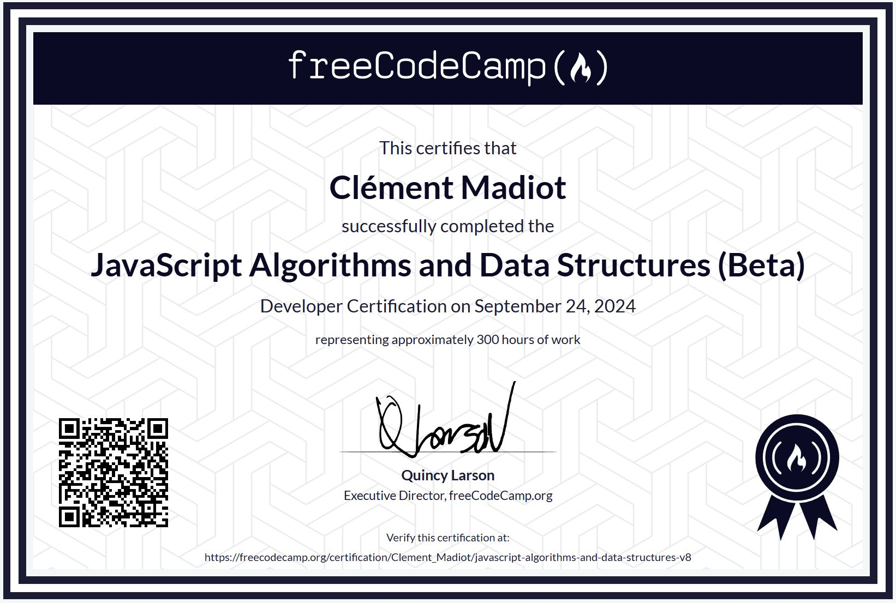

<div align="center">
  
</div>
<h3  align="center">FreeCodeCamp JavaScript Algorithms and Data Structures</h3>
</div>

## <br /> 📋 <a name="table">Summary</a>

- ✨ [Introduction](#introduction)
- 🎓 [Projects](#projects)
- 📚 [Courses](#courses)

## <a name="introduction">✨ Introduction</a>

[FR] Ce dépôt GitHub rassemble l'ensemble de mes projets réalisés dans le cadre des cours et certifications JavaScript de freeCodeCamp. Vous trouverez ici les exercices, les projets finaux et tout le code associé à mon parcours d'apprentissage.

[ENG] This GitHub repository contains all my projects completed as part of freeCodeCamp's JavaScript courses and certifications. Here, I find exercises, final projects, and all the code associated with my learning journey.

## <br /> <a name="projects">🎓 Projects</a>
- [x] [Palindrome Checker](./Certification/Palindrome-checker/)  
- [x] [Roman Numeral Converter](./Certification/RomanNumConverter/)    
- [x] [Telephone Number Validator](./Certification/Telephone_number_validator/)    
- [x] [Cash Register](./Certification/Cash_register/)    
- [x] [Pokémon Search App](./Certification/Pokemon_search/)    

## <a name="courses">🎓 Courses</a>

### 1 Project Certification: Palindrome Checker

> This is one of the required projects to earn your certification.

> For this project, you'll build an application that checks whether a given word is a palindrome.

```
1. Gradebook_App: Review JavaScript Fundamentals
2. RPG-Dragon-repeller : Learn Basic JavaScript by Building a Role Playing Game, Completed
3. Random_background-color: Learn Basic Debugging by Building a Random Background Color Changer
4. Calorie_counter: Learn Form Validation
5. Rock-Paper-Scissors: Review DOM Manipulation by Building a Rock, Paper, Scissors Game
6. Music-Player: Learn basic string and array methods by building a music player
```

### 2 Project Certification: Roman Numeral Converter

> This is one of the required projects to claim your certification.

> For this project, you'll build an application that converts integers to Roman numerals.

```
1. Date-Object: Learn the Date Object by Building a Date Formatter, Complete
2. Football-Team-Player: Learn Modern JavaScript Methods by Building Football Team Cards, Not started
3. Todo-App: Learn localStorage by Building a Todo App, Not started
4. Decimal-to-binary: Learn Recursion by Building a Decimal to Binary Converter
```

### 3 Project Certification: Telephone Number Validator

> This is one of the required projects to claim your certification.

> For this project, you'll build an application that checks if a number is a valid United States phone number.

```
1. Regular-Expression: Learn Regular Expressions by Building a Spam Filter
2. Number-sorter: Learn Basic Algorithmic Thinking by Building a Number Sorter
3. Calculator-stat: Learn Advanced Array Methods by Building a Statistics Calculator
4. Spreadsheet: Learn Functional Programming by Building a Spreadsheet
```

### 4 Project Certification: Cash Register

> This is one of the required projects to earn your certification.

> For this project, you'll build a cash register web app.

```
1. Shopping_cart : Learn Basic OOP by Building a Shopping Cart
2. Platformer_game : Learn Intermediate OOP by Building a Platformer Game
3. Dice_game : Review Algorithmic Thinking by Building a Dice Game
```

### 5 Project Certification: Build a Pokémon Search App

> This is one of the required projects to earn your certification.

> For this project, you will build a Pokémon search app.

```
1. Authors_page : Learn Fetch and Promises by Building an fCC Authors Page
2. Leaderboard : Learn Asynchronous Programming by Building an fCC Forum Leaderboard
```